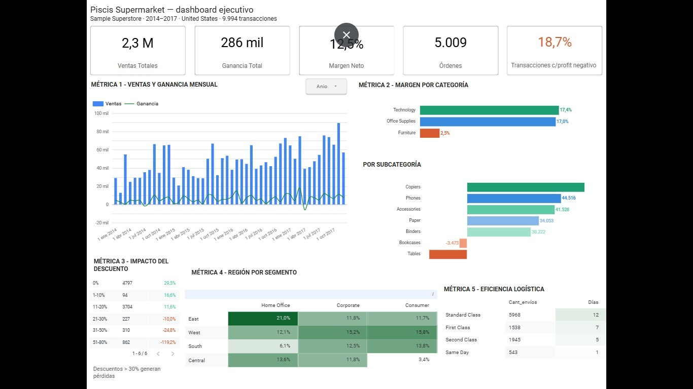

## Overview

End-to-end data analysis project built on the **Sample Superstore** dataset (Kaggle).  
The goal was to identify profitability drivers and risk factors across 9,994 transactions spanning 4 years of US retail operations.

**Tools used:** Google Sheets · BigQuery (SQL) · Looker Studio · Claude AI  
**Period:** 2014 – 2017 · United States · 3 product categories · 4 regions

---

## Business Questions Answered

1. How did sales and profit evolve month by month across 4 years?
2. Which product categories and sub-categories generate the most (and least) profit?
3. At what discount level does the business start losing money?
4. Which region × customer segment combination is most profitable?
5. How efficient is each shipping mode in terms of delivery days?

---

## Key Findings

| Metric | Value |
|--------|-------|
| Total Sales | $2.30M |
| Total Profit | $286K |
| Net Margin | 12.5% |
| Unique Orders | 5,009 |
| Transactions with negative profit | 18.7% |

### 🔴 Critical finding — Discounts destroying margin

Discounts above 30% generate **negative margins systematically**:

| Discount Range | Net Margin |
|----------------|------------|
| 0% | +29.5% |
| 1–10% | +16.6% |
| 11–20% | +11.6% |
| 21–30% | -10.0% |
| 31–50% | -24.8% |
| 51–80% | **-119.2%** |

862 transactions used discounts between 51–80% — each one actively losing money.

### 📦 Furniture category is structurally unprofitable

- Furniture net margin: **2.5%** (vs 17.4% for Technology)
- Tables sub-category: **-$17,725** in total losses
- Bookcases sub-category: **-$3,473** in total losses

### 🌎 Best performing segment

**East region + Home Office segment → 21.0% margin** — the highest in the portfolio.  
**Central region + Consumer segment → 3.4% margin** — requires immediate commercial strategy review.

### 📈 Q4 seasonality

October–December consistently concentrates the highest sales peaks across all 4 years.  
Inventory and logistics preparation before Q4 is critical.

---

## Data Pipeline

```
Kaggle Dataset (.xlsx)
        ↓
Google Sheets (data cleaning)
  - Column names standardized (Sub-Category → Sub_Category)
  - Date format converted to YYYY-MM-DD
  - Numeric types validated
        ↓
BigQuery (SQL transformations)
  - 6 analytical views created
  - Metrics calculated with standard SQL aggregations
        ↓
Looker Studio (dashboard)
  - 5 interactive charts with filters
  - Connected directly to BigQuery views
```

---

## SQL Views

All views are in the `/sql` folder. Each view corresponds to one dashboard metric:

| View | Metric |
|------|--------|
| `vista_ventas_ganancia_anio` | Monthly sales and profit trend |
| `vista_margen_por_categoria` | Profit margin % by category |
| `vista_margen_por_subcategoria` | Profit margin % by sub-category |
| `vista_impacto_descuentos` | Discount impact on margin |
| `vista_performance_region_segmento` | Sales and margin by region × segment |
| `vista_eficiencia_logistica` | Avg shipping days by shipping mode |

---

## Dashboard

> 🔗 [View live dashboard in Looker Studio](https://datastudio.google.com/reporting/ed8569a2-e6d6-4a5d-bc64-9e7e2e970ea6)



---

## Business Recommendations

1. **Cap discounts at 20% maximum** — discounts above 30% destroy margin across all categories
2. **Review Furniture pricing strategy** — 2.5% margin doesn't cover structural costs
3. **Invest more in East + Home Office** — 21% margin is the portfolio's highest performer
4. **Prepare for Q4** — stock and logistics must be ready before October every year
5. **Audit Central + Consumer** — 3.4% margin is unsustainable long-term
6. **Evaluate shipping mode mix** — 59.7% uses Standard Class (5 days); analyze cost of upgrading key clients to First Class

---

## Dataset

- **Source:** [Sample Superstore — Kaggle](https://www.kaggle.com/datasets/vivek468/superstore-dataset-final)
- **Rows:** 9,994
- **Columns:** 21
- **Period:** January 2014 – December 2017
- **Geography:** United States (4 regions, ~530 cities)

---

## Author

**Veronica Canzani**  
Data Analyst | Google Sheets · BigQuery · SQL · Looker Studio · Power BI · Excel · Claude AI  

🔗 https://linkedin.com/in/veronica-canzani · 🐙 https://github.com/VheroC
